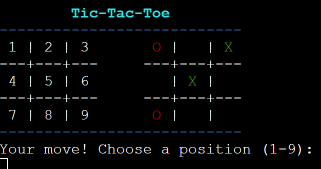
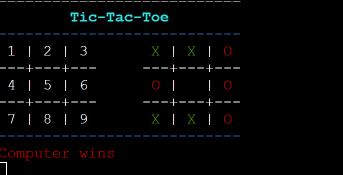

# Tic Tac Toe
Hello there! I've always had a soft spot for the simple yet timeless game of Tic Tac Toe. It's one of those games that brings back fond memories of rainy afternoons, scribbling on notepads, and friendly competition. With an aim to recreate those nostalgic moments and introduce this classic to a new generation, I embarked on a journey to reimagine Tic Tac Toe using modern web technologies. Whether you're here for a quick game or just curious about my take on this beloved classic, I hope you enjoy playing it as much as I enjoyed building it. Welcome to my version of Tic Tac Toe!

Tic Tac Toe, also known as Noughts and Crosses, is a timeless classic that pits two players against each other in a 3x3 grid. The goal is simple: be the first to get three of your marks in a row, either horizontally, vertically, or diagonally.

View the live site [here](https://tic-tac-toe42-04956c759dca.herokuapp.com/).

## Contents

* [Purpose](#purpose)
* [User Experience](#user-experience)
   * [Project Goals](#project-goals)
   * [User Stories](#user-stories)
   * [Program Flowchart](#program-flowchart)
* [How To Play](#how-to-play)   
* [Features](#features)
   * [Existing Features](#existing-features)
   * [Future Features](#future-features)
* [Technologies Used](#technologies-used)
* [Python Packages Used](#python-packages-used)
* [Testing](#testing)
   * [Manual Testing](#manual-testing)
   * [Python PEP8 Validation](#python-pep8-validation)
   * [Testing User Stories](#testing-user-stories)
   * [Development Bugs](#development-bugs)
* [Deployment and Development](#deployment-and-development)
   * [Deploying the App](#deploying-the-app)
   * [Forking The Repository](#forking-the-repository)
   * [Cloning The Repository](#cloning-the-repository)
* [Credits](#credits)
* [Acknowledgements](#acknowledgements)

## Purpose

The purpose of this project was to re-imagine a classic game using modern web technologies, providing both nostalgic feelings for those who played it during their childhood and introducing it to new generations.

## User Experience

### Project Goals 

As the site owner, I want the game to:
* Provide an intuitive user interface.
* Ensure smooth gameplay.
* Encourage users to play multiple rounds.

[Back to top](#contents)

### User Stories

* As a casual player, I want a game that is easy to understand so I can start playing immidiately.
* As a competitive  player, I want the game to challenge me.
* As a nostalgic gamer, I want the classic look and feel so I can reminisce about the old days.

### Program flowchart

The flowchart was created using [Lucidchart](https://www.lucidchart.com/pages/).

## How To Play

1. Starting: Launch the game script to see the Tic-Tac-Toe logo and rules.
2. Setting Up:
    * Choose your difficulty:
        * Easy: Computer moves randomly.
        * Medium: Computer plays to win.
        * Hard: Computer plays to win and blocks you.
3. Board & Moves:
    * The board is numbered 1-9.
    * Play as 'X'. The computer is 'O'.
    * Input a number (1-9) to place your mark.
4. Winning: Line up three 'X' in a row, column, or diagonal. If the computer aligns three 'O's first, it wins,
5. Ending:
    * Game outcomes: You win, the computer wins, or a draw.
    * After two games, choose to play again, adjust the difficulty, or exit.
6. Exit: When done, the game thanks you and exits.                 

## Features

### Existing Features

#### Interactive Welcome screen: 
Displays the game's logo, rules, and prompts the user to choose a difficulty level.

#### Difficulty Levels: 
Player can choose between 'Easy', 'Medium', and 'Hard' difficulty levels.
Player can type 'e' or 'easy' and so on for other difficulties.

#### Dynamic Display:
Real-time board updates after each move. Includes colorful terminal display using 'colorama'. To assist players in making their moves, a clearly labeled map of the board is presented on the left side, featuring numbered positions for easy reference.

#### Player vs Computer Mode:
Player ('X') competes against the computer ('O'). Player's symbol is green and computer's is red.

#### Scoring System:

Keeps track of wins for both the player and computer.

#### Winning and Draw Checks

The game detects and announces wins for either side, as well as draws.

#### Computer Strategy

Computer's moves vary based on difficulty:

**Easy Mode ('e'):** In this mode, the computer doesn't strategize much. Instead, it simply makes random moves. The computer selects one of the available positions on the board at random and places its symbol there.

**Medium Mode ('m'):** The computer's primary onjective in this mode is to win. It scans the board for a potential winning move. If such a move exists, the computer will place its symbol in that position to win the game. If no winning move is identified, the computer will fall back to making a random move, just like in the easy mode.

**Hard Mode ('h'):** In this mode, the computer's strategy is twofold:
1. Winning Move: Initially, it looks for a move that allows it to win the game. If identified, it will execute that move.
2. Blocking Player: If no winning move is found, the computer checks if the player is about to win in the next move. If so, it places its symbol to block the player from achieving a three-in-a-row.
* If neither of the above conditions is met, the computer reverts to making a random move.

This strategy ensures that the computer becomes increasingly challenging to defeat as the difficulty level rises. In "Hard" mode, the computer not only plays to win but also actively tries to prevent the player from winning.

#### Replayability 

After a set of games, player can choose to continue, increase difficulty, or exit.

#### Clear Console Interactivity

Provides a fresh view for each move by clearing the console, also if the user enters an incorrect or invalid command, the console will instantly clear itself, prompting the user to input the correct command without any lingering distractions. This design prioritizes user experience, ensuring that tasks are performed with ease and minimal interference.

### Future Features

1. Multiplayer Mode: A mode where players can face off against each other.
2. Enhanced AI: Considering the integration of the Minimax algorithm to make the AI opponent more strategic.
3. Username Integration: The option for players to set and use custom usernames might be introduced.
4. Increased Competition: Looking into ways to elevate the gameplay for a more challenging experience.

## Technologies Used

* [Lucidchart](https://www.lucidchart.com/pages/)
    * Used to create the program flowchart.
* [HTML5](https://html.spec.whatwg.org/)
    * (provided in the [code institute template](https://github.com/Code-Institute-Org/python-essentials-template)).
* [CSS](https://www.w3.org/Style/CSS/Overview.en.html)
    * (provided in the [code institute template](https://github.com/Code-Institute-Org/python-essentials-template)).
* [Python 3.11.5](https://www.python.org/)
    * The main programming language used for the game's logic.
* [GitHub](https://github.com/)
    * Used to store the project's repository and manage the versioning of the application.

## Python Packages Used

* random: 
    * Used for generating random numbers to decide the computer's move in the game.
* os: 
    * Used to interact with the operating system, mainly to clear the console screen.
* [colorama](https://pypi.org/project/colorama/):
    * Helps in adding colored output to the terminal for an enhanced user experience.
    * Components: `init`, `Fore`, `Style`
* time: 
    * Used to introduce small delays for a better game flow experience.

## Testing 

Testing was extensively conducted for this project. It's important to note that the code institute template provided the HTML, CSS, and JavaScript. As such, these elements, along with responsive design, were not within the project's scope and were not considered in my evaluations.

### Manual Testing

#### Welcome Screen

|**TEST** | **ACTION** | **EXPECTATION** | **RESULT** |
|-----------|-----------|-----------|-----------|
|WelcomeScreen - Logo & Rules Display | Launch the game | The game's logo and rules are displayed correctly | Works as expected ** |
|Valid Difficulty Selection| Enter: e, easy, m, medium, h, hard|App should accept and set the respective difficulty level|Works as expected|
|Invalid Difficulty Selection|Enter invalid data other then e, easy, m, medium, h, hard|App informs user of invalid selection & prompts to choose a valid difficulty|Works as expected|

** On certain devices, the ASCII art does not display correctly. However, opening developer tools and reloading the page resolves the issue. I reached out to my tutor, who confirmed that it rendered correctly for them and indicated there was no problem.

#### Game Play

|**TEST** | **ACTION** | **EXPECTATION** | **RESULT** |
|-----------|-----------|-----------|-----------|
|Win/Lose/Draw Outcomes|Play game in each difficulty level|Ensure all possible outcomes (win, lose, draw) can be achieved| Works as expected|
|Computer Move - Easy|Set computer to easy level and start the game|Computer makes random moves|Works as expected|
|Computer Move - Medium|Set computer to medium level and start the game|Computer makes semi-strategic moves|Works as expected|
Computer Move - Hard|Set computer to hard level and start the game|Computer makes fully strategic moves|Works as expected|
|Full Board Draw Condition|Fill all cells without getting three in a row|Game identifies the condition as a draw|Works as expected|
|Occupied Spot Move|Attempt to play in an already occupied cell|App provides error message indicating spot is taken|Works as expected|
|Invalid Move Input|Enter characters, numbers out of board's range|App informs user of invalid move & prompts to try again|Works as expected|

#### End of Game

|**TEST** | **ACTION** | **EXPECTATION** | **RESULT** |
|-----------|-----------|-----------|-----------|
|Correct Winner|Complete a game|The correct winner (player or computer) is declared|Works as expected|
|Score Update|Finish a game|Scores for player and computer should be updated correctly|Works as expected|
|Post-Session-Choices|After a game ends|Choices like continue, increase difficulty, and exit should be presented & work correctly|Works as expected|
|hard difficulty Post-Session Choices|After a game ends in Hard Difficulty|Only options to continue or exit should be presented|Works as expected|
|Prompt to Play Again|At the end of a session|Game should ask if player wants to play again and handle both valid and invalid inputs|Works as expected|

### Python PEP8 Validation

Based on my mentor's recommendation, I installed Flake8 into my vscode. After addressing numerous issues, primarily extra spaces and excessively long lines, I was able to correct all the errors.

* pip install flake8

### Testing User Stories

#### User Story 1:

* As a casual player, I want a game that is easy to understand so I can start playing immediately.

    **Test:** Navigated to the game link and reviewed the welcome screen and instructions.

    **Result:** Instructions were clear and precise. The game was immediately understandable, and the welcome screen was intuitive

#### User Story 2:

* As a competitive player, I want the game to challenge me.

    **Test:** Played the game on different difficulty levels (easy, medium, and hard).

    **Result:** The easy level was quite simple and suitable for a casual player. Medium posed a decent challenge. The hard level was notably more challenging, making it harder to win against the computer. This meets the requirements of a competitive player.

#### User Story 3:

* As a nostalgic gamer, I want the classic look and feel so I can reminisce about the old days.

    **Test:** Played the game and evaluated the design and gameplay elements.

    **Result** The game's interface and layout definitely provided a sense of nostalgia, especially the simple board design. The colored terminal display added a modern touch but still kept the classic feel intact.

### Development Bugs

Throughout the development process, each feature underwent manual testing. This led to the identification and resolution of several issues. As a result, all features are now functioning as outlined in the [features section](#features). A detailed account of the challenges faced during development is provided below.

1. **Intended Outcome:** Players expect the computer to block potential winning moves when its difficulty is set to 'hard'. 
    * ***Issue Found:***
        * The computer does not block the player's winning moves consistently when set to 'hard' difficulty.
    * ***Causes:***
        * The `make_move` function does not correctly act upon the result from the `find_blocking_move` method.
        * The order of checking winning moves for the computer and blocking moves for the player might cause the oversight
    * ***Solution Found***
        * I Modified the make_move function to prioritize checking for its own winning moves first (find_winning_move for 'O') only when on 'hard' difficulty, and then, if none are found, check for blocking moves to prevent the player from winning (find_blocking_move). 

2. **Intended Outcome:** After 2 games on 'easy' difficulty, the game should prompt the player to either increase difficulty or exit. If they choose to increase, the next games should be on the higher difficulty. 
    * ***Issue Found:***
        * After selecting to increase the difficulty, the next games do not reflect the increased difficulty.
    * ***Causes:***
        * The `computer` object, responsible for the computers's game strategy, isnt't being updated with the new difficulty setting even after the player's decision to increase it
    * ***Solution Found***
        * Initialization: When the difficulty is adjusted within the game loop, a fresh instantiation of the computer object is essential to reflect the new difficulty.
        * Implementation: After the player chooses to increase difficulty, the solution involves reinitializing the computer object with the new difficulty setting. This was done with the line: `computer = Computer(self.difficulty, self.check_winner)` 

3. **Intended Outcome:** After two games, when the player is prompted for a decision, the game screen should be cleared to provide a fresh view.
    * ***Issue Found:***
        * The game's console display remains cluttered with previous game information when prompting the user after two games.
    * ***Causes:***
        * There was no command to clear the console screen after the completion of two games and before prompting the user for their decision.
    * ***Solution Found***
        * Implementation of Clearing Mechanism: Integrate the clearConsole() function into the game loop, specifically before displaying the score and prompting the user after the two games.
        * Placement in Code: This was achieved by inserting the clearConsole() function call just before the score is displayed after two games are finished. By doing this, previous game data will be removed, presenting a clean slate to the user for their next action decision.               

4. **Intended Outcome:** Only the actual difficulty level input on the welcome screen should be displayed in cyan. After the first round, the "Difficulty Level" text should revert to white while the actual difficulty remains cyan. 
    * ***Issue Found:***
        * After the Welcome screen, both the "Difficulty Level" text and the actual difficulty are displayed in cyan. After the first round, the color for "Difficulty Level" switches back to default, but the intended behavior was for it never to be cyan in the first place.
    * ***Causes:***
        * The color setting from the Welcome screen's difficulty input is persisting beyond the input phase and affecting subsequent text displays in the game.
    * ***Solution Found***
        * Immediate Color Reset: Implement the Style.RESET_ALL command right after the difficulty input on the Welcome screen to prevent the cyan color from carrying over to subsequent text. This will ensure the color applied to the input does not affect other parts of the game.
        * This change will maintain the color of the actual difficulty in cyan while ensuring the "Difficulty Level" text remains in its default white color. 

## Deployment and Development

* The project was developed using VS Code.
* The project is hosted on [GitHub](https://github.com/matus42/TicTacToe)

### Deploying the App

The deployment of the project was done using [Heroku](https://www.heroku.com/) through the following steps.

1. Log in to Heroku or create an account if necessary.
2. Click on the button labeled "New" from the dashboard in the top right corner and select the "Create new app" option in the drop-down menu.
3. Enter a unique name for the application and select the region you are in.
   * For this project, the unique name is "tic-tac-toe42" and the region selected is Europe.
4. Click on "create app".
5. Navigate to the settings tab and locate the "Config Vars" section and click "Reveal config vars".
6. Add a config var. 
   * In the "KEY" field:
      * enter PORT in all capital letters.
   * In the "VALUE" field:
      * enter 8000 and click "Add".
7. Scroll to the "Buildpacks" section and click "Add buildpack".
8. Select Python and save changes.
9. Add another buildpack and select Nodejs then save changes again.
10. Ensure that the python buildpack is above the Nodejs buildpack.
11. Navigate to the "Deploy" section by clicking the "Deploy" tab in the top navbar.
12. Select "GitHub" as the deployment method and click "Connect to GitHub".
13. Search for the GitHub repository name in the search bar.
14. Click on "connect" to link the repository to Heroku.
15. Scroll down and click on "Deploy Branch".
16. Once the app is deployed, Heroku will notify the user and provide a button to view the app.

* If you wish to rebuild the deployed app automatically every time you push to GitHub, you may click on "Enable Automatic Deploys".

### Forking the Repository

This can be done to create a copy of the repository. The copy can be viewed and edited without affecting the original repository.

To fork the repository through GitHub, take the following steps:
1. In the "TicTacToe" repository, click on the "fork" tab in the top right corner.
2. Click on "create fork" to fork the repository.

### Cloning The Repository

To clone the repository through GitHub:

1. In the repository, select the "code" tab located just above the list of files and next to the gitpod button.
2. Ensure HTTPS is selected in the dropdown menu.
3. Copy the URL under HTTPS.
4. Open Git Bash in your IDE of choice.
5. Change the current working directory to the location where you want the cloned directory to be created.
6. Type "git clone" and paste the URL that was copied from the repository.
7. Press the "enter" key to create the clone.

*  IMPORTANT: If developing locally on your device, ensure you set up/activate virtual environment before installing requirements.txt file.

## Credits

* The idea how to make computer moving [Stack Overflow](https://stackoverflow.com/questions/20920696/tic-tac-toe-computer-move)
* For hosting my images [postimages.org](https://postimages.org/)
* Background image was downloaded from [pixabay.com](https://pixabay.com/photos/tic-tac-toe-empty-fields-mystery-1954446/)
* Got favicon from [icon8.com](https://icons8.com/icons/set/favicon)
* I used [Lucid.app](https://lucid.app/documents#/documents?folder_id=home) to create flow chart.
* I got ASCII art logo from [patorjk.com](https://patorjk.com/software/taag/#p=testall&h=2&v=1&f=Blocks&t=Type%20Something%20)
* Code for clearing console from [delftstack.com](https://www.delftstack.com/howto/python/python-clear-console/)
* To understand Tic Tac Toe logic credit to [geekflare.com](https://geekflare.com/tic-tac-toe-python-code/)
* Code institute for the deployment terminal
* How to add favicon, background picture i learned from my mentor [dnlbowers](https://github.com/dnlbowers/battleships/blob/main/views/layout.html)
* function for delay printed text got from [programiz.com](https://www.programiz.com/python-programming/time/sleep)
* got inspired byt this video starting at 35:40 by [freeCodeCamp.org](https://www.youtube.com/watch?v=8ext9G7xspg&t=3599s&ab_channel=freeCodeCamp.org)

## Acknowledgements

This site serves as my third portfolio project for the Full Stack Software Development course at Code Institute. I extend my heartfelt gratitude to everyone who provided unwavering support throughout its development. 

* A heartfelt thanks to my mentor, David Bowers, for his invaluable guidance and inspiration.
* I'm deeply grateful to the Code Institute community, which includes both dedicated students and the supportive staff.
* A special thank you to my fiancé and our two little ones for their patience and understanding throughout this project.

------------------
Matus Gabris 2023