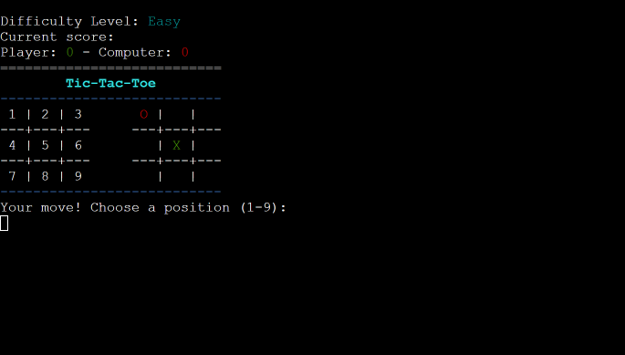
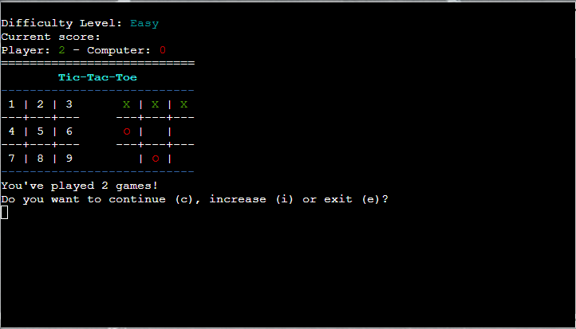

# Tic Tac Toe
Hello there! I've always had a soft spot for the simple yet timeless game of Tic Tac Toe. It's one of those games that brings back fond memories of rainy afternoons, scribbling on notepads, and friendly competition. With an aim to recreate those nostalgic moments and introduce this classic to a new generation, I embarked on a journey to reimagine Tic Tac Toe using modern web technologies. Whether you're here for a quick game or just curious about my take on this beloved classic, I hope you enjoy playing it as much as I enjoyed building it. Welcome to my version of Tic Tac Toe!

Tic Tac Toe, also known as Noughts and Crosses, is a timeless classic that pits two players against each other in a 3x3 grid. The goal is simple: be the first to get three of your marks in a row, either horizontally, vertically, or diagonally.

View the live site [here](https://tic-tac-toe42-04956c759dca.herokuapp.com/).

## Contents

* [Purpose](#purpose)
* [User Experience](#user-experience)
   * [Project Goals](#project-goals)
   * [User Stories](#user-stories)
   * [Program Flowchart](#program-flowchart)
* [Features](#features)
   * [Existing Features](#existing-features)
   * [Future Features](#future-features)
* [Technologies Used](#technologies-used)
* [Python Packages Used](#python-packages-used)
* [Testing](#testing)
   * [Python PEP8 Validation](#python-pep8-validation)
   * [Testing User Stories](#testing-user-stories)
   * [Development Bugs](#development-bugs)
* [Deployment and Development](#deployment-and-development)
   * [Deploying the App](#deploying-the-app)
   * [Forking The Repository](#forking-the-repository)
   * [Cloning The Repository](#cloning-the-repository)
* [Credits](#credits)
* [Acknowledgements](#acknowledgements)

## Purpose

The purpose of this project was to re-imagine a classic game using modern web technologies, providing both nostalgic feelings for those who played it during their childhood and introducing it to new generations.

## User Experience

### Project Goals 

As the site owner, I want the game to:
* Provide an intuitive user interface.
* Ensure smooth gameplay.
* Encourage users to play multiple rounds.

[Back to top](#contents)

### User Stories

* As a casual player, I want a game that is easy to understand so I can start playing immidiately.
* As a competitive  player, I want the game to challenge me.
* As a nostalgic gamer, I want the classic look and feel so I can reminisce about the old days.

### Program flowchart

The flowchart was created using [Lucidchart](https://www.lucidchart.com/pages/).

## Features

### Existing Features

#### Interactive Welcome screen: 
Displays the game's logo, rules, and prompts the user to choose a difficulty level.

#### Difficulty Levels: 
Player can choose between 'Easy', 'Medium', and 'Hard' difficulty levels.
Player can type 'e' or 'easy' and so on for other difficulties.

#### Dynamic Display:
Real-time board updates after each move. Includes colorful terminal display using 'colorama'. To assist players in making their moves, a clearly labeled map of the board is presented on the left side, featuring numbered positions for easy reference.

#### Player vs Computer Mode:
Player ('X') competes against the computer ('O'). Player's symbol is green and computer's is red.

#### Scoring System:

Keeps track of wins for both the player and computer.

#### Winning and Draw Checks

The game detects and announces wins for either side, as well as draws.

#### Computer Strategy

Computer's moves vary based on difficulty:

**Easy Mode ('e'):** In this mode, the computer doesn't strategize much. Instead, it simply makes random moves. The computer selects one of the available positions on the board at random and places its symbol there.

**Medium Mode ('m'):** The computer's primary onjective in this mode is to win. It scans the board for a potential winning move. If such a move exists, the computer will place its symbol in that position to win the game. If no winning move is identified, the computer will fall back to making a random move, just like in the easy mode.

**Hard Mode ('h'):** In this mode, the computer's strategy is twofold:
1. Winning Move: Initially, it looks for a move that allows it to win the game. If identified, it will execute that move.
2. Blocking Player: If no winning move is found, the computer checks if the player is about to win in the next move. If so, it places its symbol to block the player from achieving a three-in-a-row.
* If neither of the above conditions is met, the computer reverts to making a random move.

This strategy ensures that the computer becomes increasingly challenging to defeat as the difficulty level rises. In "Hard" mode, the computer not only plays to win but also actively tries to prevent the player from winning.

#### Replayability 

After a set of games, player can choose to continue, increase difficulty, or exit.

#### Clear Console Interactivity

Provides a fresh view for each move by clearing the console, also if the user enters an incorrect or invalid command, the console will instantly clear itself, prompting the user to input the correct command without any lingering distractions. This design prioritizes user experience, ensuring that tasks are performed with ease and minimal interference.

## Future Features

1. Multiplayer Mode: A mode where players can face off against each other.
2. Enhanced AI: Considering the integration of the Minimax algorithm to make the AI opponent more strategic.
3. Username Integration: The option for players to set and use custom usernames might be introduced.
4. Increased Competition: Looking into ways to elevate the gameplay for a more challenging experience.

